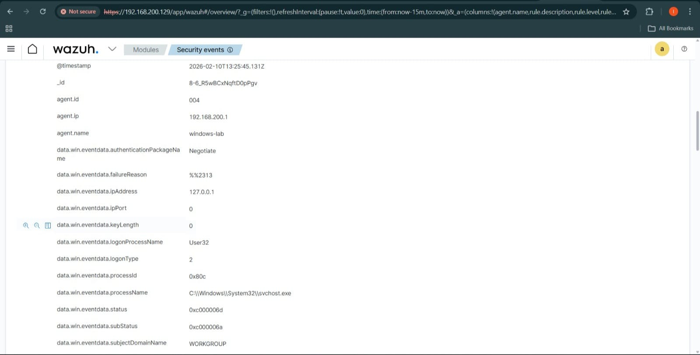
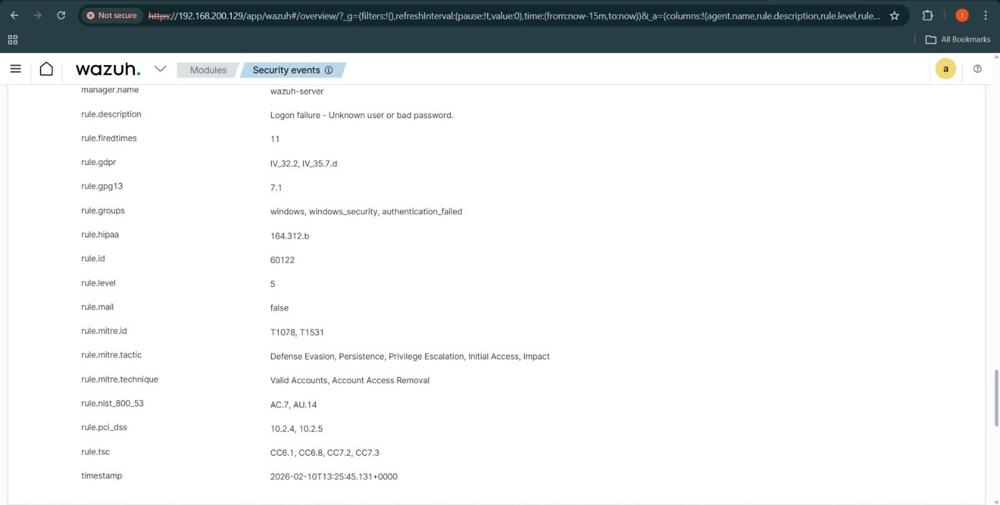

# soc-authentication-failure-analysis
Simulated SOC investigation detecting a Windows brute-force attack using Wazuh SIEM and Sysmon logs mapped to MITRE ATT&amp;CK.

🛡️ SOC Incident Report — Windows Brute Force Attack Detection
Simulated SOC investigation detecting a Windows brute-force attack using Wazuh SIEM + Sysmon logs mapped to MITRE ATT&CK.

🎯 Objective
Detect and analyze unauthorized authentication attempts against a Windows endpoint and determine if attacker gained access.

🧪 Lab Setup
Component
Technology
SIEM
Wazuh
Endpoint Logs
Windows Security Logs + Sysmon
Attack Type
Brute Force Login
Target User
victim123

🚨 Step 1 — Detection: Multiple Authentication Failures
Wazuh detected abnormal authentication activity.

🚨 Step 2 — Correlated Failed Logins
SIEM correlated repeated failed login attempts indicating brute force behaviour.

🔍 Step 3 — Log Analysis (Windows Event ID 4625)
Windows Security logs confirm failed login attempts.

Additional log fields:

Key Findings:
Event ID: 4625
Status: 0xC000006D
Substatus: 0xC000006A
Logon Type: 2 (Interactive)
Source IP: 127.0.0.1
🧠 Step 4 — SIEM Rule Triggered
Wazuh mapped the attack to MITRE ATT&CK.

MITRE Mapping:
T1110 — Brute Force
T1078 — Valid Accounts

📊 Impact Assessment
The attacker obtained valid user access to the endpoint.
Possible risks:
Privilege escalation
Persistence
Data exfiltration
Lateral movement
Severity: HIGH

🛠️ Recommended Remediation
Reset compromised user password
Enable account lockout policy
Enforce strong password policy
Enable MFA
Monitor for lateral movement
Block repeated login attempts

🏁 Final Verdict
This incident represents a successful brute-force attack resulting in unauthorized access.

📁 Screenshots
### Detection – Multiple Authentication Failures Detected

### Multiple Failed Login Attempts Detected

### Event Log Analysis (Windows Event ID 4625)

### Event Log Analysis (Windows Event ID 4625)

Additional forensic fields from the same log:

### SIEM Detection – Wazuh Rule Triggered

Wazuh correlated Windows Security logs and triggered an authentication failure detection rule.

